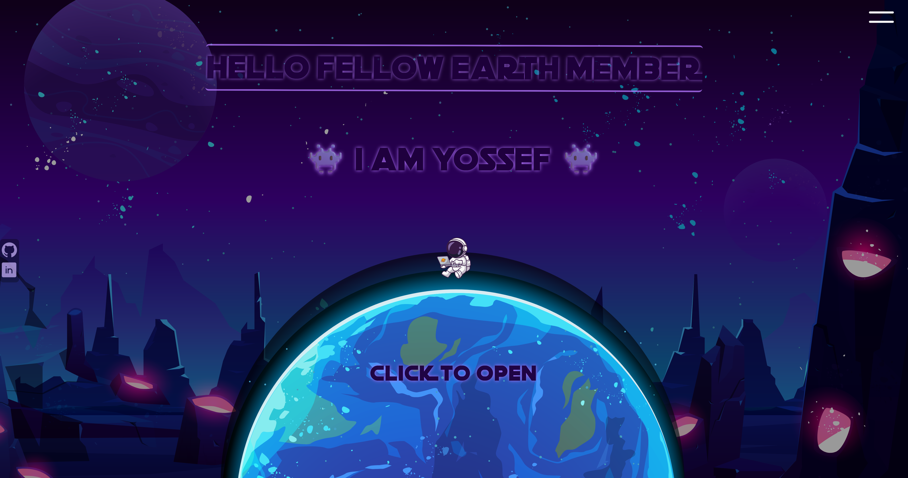
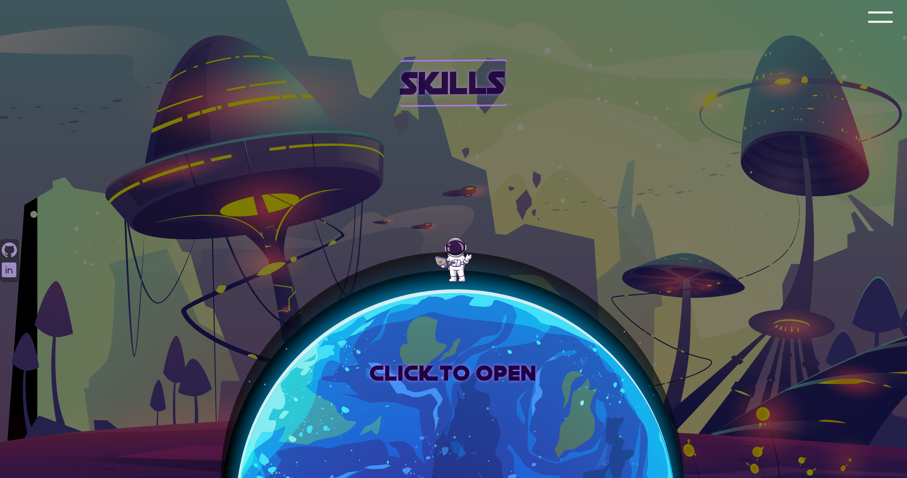
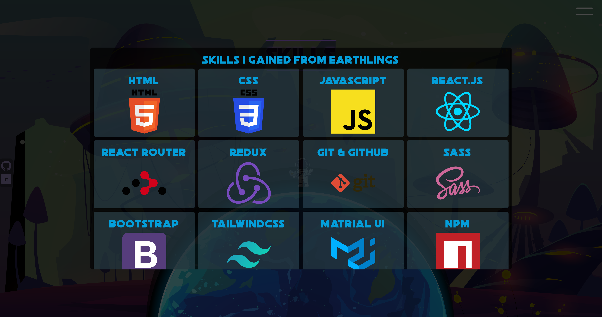
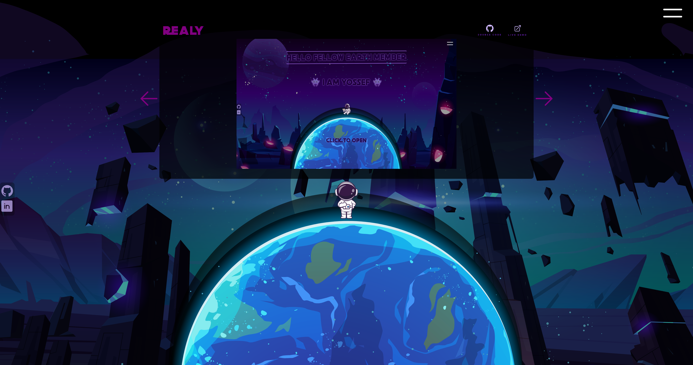

# Portfolio



Welcome to my portfolio! This project showcases my skills and projects using the following technologies and libraries:

- **HTML**
- **Sass**
- **JavaScript**
- **React.js**
- **react-router-dom**
- **react-redux**
- **redux toolkit**
- **Heroicons**
- **npm**
- **Vite**

## Pages

### Home


The Home page serves as the introduction to my portfolio, providing an overview of who I am and what I do.

### Skills




The Skills page showcases my technical skills and expertise in various technologies and tools.

### Experience



The Experience page details my work history, including previous jobs, projects, and accomplishments.

### 404 Not Found


The 404 Not Found page is displayed when a user tries to access a page that doesn't exist. It helps users navigate back to the main sections of the portfolio.

## Installation and Usage

Here are the installation and usage instructions:

### Installation

1. Clone the repository:

```bash
git clone https://github.com/yossefelnajjar/portfolio.git
```

2. Navigate to the project directory:

```bash
cd portfolio
```

3. Install dependencies:

```bash
npm install
```

### Usage

4. Start the development server:

```bash
npm run dev
```

5. Open your web browser and visit `http://localhost:5170` to view the portfolio.

## Contact

Feel free to reach out to me via Email or LinkedIn:

- **Email:** [yossefelnajjar@gmail.com](mailto:yossefelnajjar@gmail.com)
- **LinkedIn:** [LinkedIn Profile](https://www.linkedin.com/in/yossef-elnajjar/)
